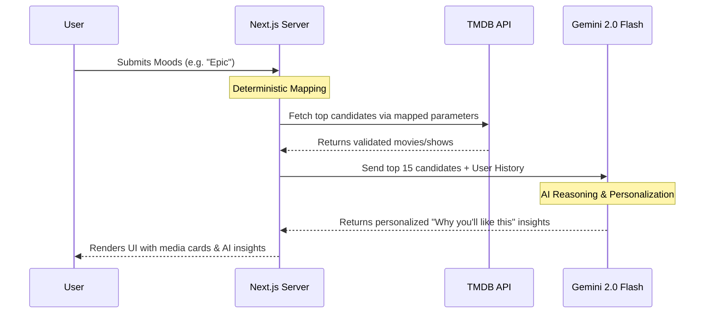

# WhatNow - Content Recommendation App

WhatNow is a personalized content recommendation platform built with Next.js. It helps users discover new movies, TV shows, and anime tailored to their precise moods and available time. 

## Features
- **AI-Driven Recommendations:** Uses the Gemini 2.0 Flash model to generate hyper-personalized media recommendations based on your unique watch history and current vibe.
- **Unified Experience:** Seamless single-user architecture where all your watch history and watchlists are securely synced with your account.
- **Server-Rendered Performance:** Key pages like History and Watchlist use Next.js Server Components for instant loading and zero layout shift.
- **Modern UI:** Built with Tailwind CSS and Framer Motion for a sleek, animated experience.
- **Authentication:** Secure user authentication using NextAuth.
- **Database:** MongoDB for robust data storage.

## Tech Stack
- [Next.js](https://nextjs.org/) (React framework, App Router)
- [Gemini SDK](https://ai.google.dev/) (AI recommendation engine)
- [Tailwind CSS](https://tailwindcss.com/) (Styling)
- [Framer Motion](https://www.framer.com/motion/) (Animations)
- [MongoDB](https://www.mongodb.com/) (Database)
- [NextAuth.js](https://next-auth.js.org/) (Authentication)
- [Zustand](https://github.com/pmndrs/zustand) (Client UI State)

## AI Recommendation Architecture

WhatNow features a highly optimized **2-Step Hybrid AI Pipeline** designed for maximum speed and minimal rate-limit consumption. 



## Getting Started

First, install the dependencies:
```bash
npm install
```

Then, run the development server:
```bash
npm run dev
```

Open [http://localhost:3000](http://localhost:3000) with your browser to see the result.

## Documentation
For more detailed information, please refer to the `docs/` folder:
- [Architecture](docs/ARCHITECTURE.md)
- [Setup & Environment Variables](docs/SETUP.md)
