# 🍿 WhatNow - AI Content Recommendation Engine

[](https://nextjs.org/)
[](https://ai.google.dev/)
[](https://www.mongodb.com/)
[](https://tailwindcss.com/)
[](https://www.framer.com/motion/)

WhatNow is an incredibly fast, highly personalized content recommendation platform. Built for modern mobile and web experiences, it takes the guesswork out of "What should I watch?" by using an advanced AI engine combined with a collaborative filtering database.

## ✨ Key Features

- **🧠 True Collaborative AI Filtering:** WhatNow doesn't just match keywords. It analyzes your entire watch history and matches you with *other users* who share your specific taste profile via a robust MongoDB aggregation pipeline.
- **⚡ Tinder-Style Swipe Tuner:** A frictionless, mobile-first "Preference Tuner." Grab a movie card and physically swipe it right (Like) or left (Dislike) to instantly calibrate the AI's understanding of your taste.
- **🤖 Automated AI Benchmark Curation (Cron):** A Vercel Cron Job wakes up weekly to query the Gemini AI for a fresh, highly polarizing set of "benchmark" movies (e.g., *Inception*, *The Godfather*). This ensures the Swipe Tuner is always collecting the highest-quality signal data.
- **🎯 "Why You'll Like This" Insights:** Every recommendation comes with a custom, AI-generated justification tailored specifically to your history (e.g., *"For Marvel Fans"*, *"Because you loved Interstellar"*).
- **🔥 Dynamic OTT & Theatrical Badging:** Instantly parses release dates and availability to badge cards with "🍿 NEW SEASON", "🎟️ IN THEATERS", or "🔥 NEW ON NETFLIX", powered by JustWatch integration.
- **🔄 Dynamic Candidate Swapping:** Instantly removes disliked cards and replaces them with fresh candidates without a single page reload, dynamically adjusting your taste profile on the fly.

## 🏗️ AI & Data Architecture

WhatNow features a highly optimized **Hybrid AI Pipeline** designed for maximum speed, strict JSON schema adherence, and minimal token consumption.

```mermaid
sequenceDiagram
    participant Cron as Vercel Cron
    participant User
    participant NextJS as Next.js Server
    participant TMDB as TMDB API
    participant DB as MongoDB
    participant Gemini as Gemini 2.0 Flash

    %% Background Cron Job
    rect rgb(20, 20, 30)
    Note over Cron, DB: Weekly Benchmark Curation
    Cron->>NextJS: Trigger /api/cron/rotate-benchmarks
    NextJS->>Gemini: Request foundational media IDs
    Gemini-->>NextJS: Returns highly polarizing benchmarks
    NextJS->>DB: Overwrite active benchmark_sets
    end

    %% User Flow
    User->>NextJS: Submits Moods / Swipes Tuner Cards
    Note over NextJS: Extract Taste Profile (Implicit & Explicit)
    par Fetch Candidates
        NextJS->>TMDB: Fetch by Mood Genres
        NextJS->>DB: Collaborative Match (Users with similar taste)
    end
    TMDB-->>NextJS: Returns ~40 baseline candidates
    NextJS->>Gemini: Send candidates + User Profile History
    Note over Gemini: AI Reasoning, Scoring & Clever Tagging
    Gemini-->>NextJS: Returns Top Scored Candidates (Strict JSON)
    NextJS-->>User: Renders UI with media cards & custom badges
```



## 🛠️ Tech Stack

- **Framework:** Next.js (App Router, Server Actions, Server Components)
- **AI Engine:** Google Gemini SDK (`gemini-2.0-flash`)
- **Database:** MongoDB & Mongoose (NextAuth Adapter)
- **Authentication:** NextAuth.js (v5 Beta)
- **Styling:** Tailwind CSS & `clsx` / `tailwind-merge`
- **Animations:** Framer Motion (Drag APIs & AnimatePresence)
- **State Management:** Zustand (Client-side fast UI updates)
- **External APIs:** TMDB (Media Data), JustWatch (Streaming Providers)

## 🚀 Getting Started

1. **Clone the repository and install dependencies:**
   ```bash
   npm install
   ```

2. **Configure your environment variables:**
   Create a `.env.local` file and add your keys (see `docs/SETUP.md` for required keys including `GEMINI_API_KEY`, `MONGODB_URI`, etc.)

3. **Run the development server:**
   ```bash
   npm run dev
   ```

Open [http://localhost:3000](http://localhost:3000) with your browser to experience the platform.

## 📄 Documentation
For more detailed information on setup and architecture decisions, please refer to the `docs/` folder:
- [Architecture Details](docs/ARCHITECTURE.md)
- [Setup & Environment Variables](docs/SETUP.md)
